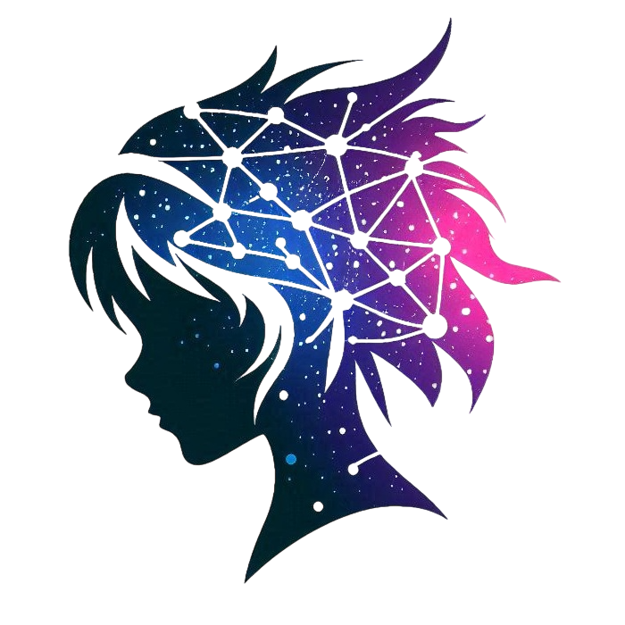

<h1 align="center">Takenoko</h1>

<i>An opinionated, perpetual WIP project aimed at hacking WanVideo 2.1(2)-T2V-(A)14B LoRA training.</i>
\
\
It is intended as a playground for experimenting with new ideas and testing various training features, including some that might ultimately turn out to be useless. The configuration file structure may change at any time, and some non-functioning options may still be present. <b>It only supports Wan2.1-T2V-14B and Wan2.2-T2V-A14B LoRA training.</b>

<h3>☄️ Disclaimer</h3>

This project would not have been possible without [musubi-tuner](https://github.com/kohya-ss/musubi-tuner). Although extensively refactored and reworked (to the point where upstream merge is no longer possible), the original project provided the foundation on which Takenoko was built. By reusing an existing and proven codebase, I was able to focus more on experimentation and learning instead of reinventing the wheel. Thanks to [kohya-ss](https://github.com/kohya-ss/) for the awesome work. 

<h3>☄️ Docs</h3>

Since this project is mostly aimed at personal use and is in a state of constant improvement (without guaranteeing backwards compatibility), it probably won't have comprehensive documentation in the near future (unless it somehow becomes popular, which I hope it does not). I've tried to provide detailed comments in the config template, but they can't cover everything. As a workaround, I recommend using [repomix](https://repomix.com/) to compress the entire repository into a single XML AI-readable file (will take around 400K tokens), then feeding it into the free Gemini 2.5 Pro with 1M context window (in [Google AI Studio](https://aistudio.google.com/)) and asking questions about various aspects of the project.

<h3>☄️ Quick Start (Windows)</h3>

1. Clone the repository.
2. Run `install.bat`.
3. Create configuration file (you can copy sample config from `configs/examples` folder).
4. Place it into the `configs` directory.
5. Launch `run_trainer.bat` and follow the instructions.

<h3>☄️ License</h3>

This project borrows code from various sources, which use different types of licenses, mostly Apache 2.0, MIT, and AGPLv3. Since AGPLv3 is a strong copyleft license, including any AGPLv3 code likely means the entire project must be released under AGPLv3. This understanding is based on publicly available licensing information.

<h3>☄️ Acknowledgments</h3>

Takenoko draws inspiration from and incorporates code, ideas, and techniques from various open-source projects and publications. I thank the authors and maintainers for their contributions. Below is a list of all sources and papers (in no particular order). I have tried to reference all sources, but if I happen to miss any (or if more specific credits are warranted), please let me know.  
\
Keep in mind that work on some features is not yet complete due to time and hardware constraints. If a feature is not working or is not implemented exactly as in the original work, all responsibility lies with my implementation, not with the authors of the original code or paper.

| Source | Type | What was borrowed | Author(s) | License | Comment |
|--------|------|---------|---------|---------|---------|
| [musubi-tuner](https://github.com/kohya-ss/musubi-tuner) | repo | - Original codebase | [kohya-ss](https://github.com/kohya-ss) | Apache 2.0 | |
| [blissful-tuner](https://github.com/Sarania/blissful-tuner) | repo | - Several optimization techniques | [Sarania](https://github.com/Sarania) | Apache 2.0 | |
| [diffusion-pipe](https://github.com/tdrussell/diffusion-pipe) | repo | - Pre-computed timestep distribution algorithm - AdamW8bitKahan optimizer  | [tdrussell](https://github.com/tdrussell) | MIT | |
| [WanTraining](https://github.com/spacepxl/WanTraining) | repo | - Control LoRA training - DWT loss | [spacepxl](https://github.com/spacepxl) | Apache 2.0 | |
| [ai-toolkit](https://github.com/ostris/ai-toolkit) | repo | - Differential output preservation - Adafactor optimizer - Prodigy 8-bit optimizer - Automagic optimizer - EMA | [ostris](https://github.com/ostris) | MIT | Automagic optimizer implementation with modifications by [tdrussell](https://github.com/tdrussell) |
| [musubi-tuner (pr)](https://github.com/kohya-ss/musubi-tuner/pull/63) | repo | - Initial implementation of validation datasets | [NSFW-API](https://github.com/NSFW-API) | Apache 2.0 | |
| [Timestep-Attention-and-other-shenanigans](https://github.com/Anzhc/Timestep-Attention-and-other-shenanigans) | repo | - Clustered MSE Loss - EW loss | [Anzhc](https://github.com/Anzhc) | AGPL-3.0 | |
| [Diffuse and Disperse: Image Generation with Representation Regularization](https://arxiv.org/abs/2506.09027v1) | paper | - Dispersive loss | Runqian Wang, Kaiming He | CC BY 4.0 | |
| [sd-scripts](https://github.com/kohya-ss/sd-scripts) | repo | - Regularization datasets - LoRA-GGPO | [kohya-ss](https://github.com/kohya-ss) | Apache 2.0 | |
| [wan2.1-dilated-controlnet](https://github.com/TheDenk/wan2.1-dilated-controlnet) | repo | - ControlNET training | [TheDenk](https://github.com/TheDenk) | Apache 2.0 | |
| [T-LoRA](https://github.com/ControlGenAI/T-LoRA) | repo | - T-LoRA training | [ControlGenAI](https://github.com/ControlGenAI) | MIT | |
| [sd-scripts (fork)](https://github.com/hinablue/sd-scripts) | repo | - Fourier loss - HinaAdaptive optimizer | [hinablue](https://github.com/hinablue) | Apache 2.0 | |
| [Muon](https://github.com/KellerJordan/Muon) | repo | - Muon optimizer | [KellerJordan](https://github.com/KellerJordan) | MIT | |
| [Sana](https://github.com/NVlabs/Sana) | repo | - CAME 8-bit optimizer | [NVlabs](https://github.com/NVlabs) | Apache 2.0 | |
| [SimpleTuner](https://github.com/bghira/SimpleTuner) | repo | - Routed TREAD - SOAP optimizer - Masked training (spatial-first loss, area interpolation, proper normalization, auto mask generation) | [bghira](https://github.com/bghira) | AGPL-3.0 | |
| [diffusion-pipe (pr)](https://github.com/Ada123-a/diffusion-pipe-TREAD) | repo | - Frame-based TREAD | [Ada123-a](https://github.com/Ada123-a) | MIT |  |
| [Representation Alignment for Generation: Training Diffusion Transformers Is Easier Than You Think](https://arxiv.org/abs/2410.06940) | paper | - Representation alignment method | Sihyun Yu, Sangkyung Kwak, Huiwon Jang, Jongheon Jeong, Jonathan Huang, Jinwoo Shin, Saining Xie | CC BY 4.0 | |
| [Sophia](https://github.com/Liuhong99/Sophia) | repo | - Sophia optimizer | [Liuhong99](https://github.com/Liuhong99) | MIT | |
| [Adaptive Non-Uniform Timestep Sampling for Diffusion Model Training](https://github.com/ku-dmlab/Adaptive-Timestep-Sampler) | repo | - Adaptive timestep sampling | [KU-DMLab](https://github.com/ku-dmlab) | MIT | see also [paper](https://arxiv.org/abs/2411.09998) |
| [Temporal Regularization Makes Your Video Generator Stronger](https://arxiv.org/abs/2503.15417) | paper | - Temporal regularization via perturbation | Harold Haodong Chen, Haojian Huang, Xianfeng Wu, Yexin Liu, Yajing Bai, Wen-Jie Shu, Harry Yang, Ser-Nam Lim | arXiv 1.0 | |
| [AR-Diffusion: Asynchronous Video Generation with Auto-Regressive Diffusion](https://arxiv.org/abs/2503.07418) | paper | - Frame-oriented Probability Propagation (FoPP) scheduler | Mingzhen Sun, Weining Wang, Gen Li, Jiawei Liu, Jiahui Sun, Wanquan Feng, Shanshan Lao, SiYu Zhou, Qian He, Jing Liu | arXiv 1.0 | |
| [Redefining Temporal Modeling in Video Diffusion: The Vectorized Timestep Approach](https://arxiv.org/abs/2410.03160) | paper | - Vectorized timestep scheduling | Yaofang Liu, Yumeng Ren, Xiaodong Cun, Aitor Artola, Yang Liu, Tieyong Zeng, Raymond H. Chan, Jean-michel Morel | arXiv 1.0 | |
| [Self Forcing: Bridging the Train-Test Gap in Autoregressive Video Diffusion](https://arxiv.org/abs/2506.08009) | paper | - Post-training autoregressive self-rollout method | Xun Huang, Zhengqi Li, Guande He, Mingyuan Zhou, Eli Shechtman | CC BY-NC-SA 4.0 | |
| [Wan2.1-NABLA](https://github.com/gen-ai-team/Wan2.1-NABLA) | repo | - Dynamic sparse attention | [gen-ai-team](https://github.com/gen-ai-team) | Apache 2.0 | |
| [VideoX-Fun](https://github.com/aigc-apps/VideoX-Fun) | repo | - Reward LoRA training | [aigc-apps](https://github.com/aigc-apps) | Apache 2.0 | |
| [Fira](https://github.com/xichen-fy/Fira) | repo | - Fira optimizer | [xichen-fy](https://github.com/xichen-fy) | Apache 2.0 | |
| [google-research](https://github.com/google-research/google-research) | repo | - Frechet Video Distance (FVD) implementation | [google-research](https://github.com/google-research) | Apache 2.0 | |
| [musubi-tuner (pr)](https://github.com/kohya-ss/musubi-tuner/pull/513) | repo | - Reflected Exponential Learning Rate scheduler | [xzuyn](https://github.com/xzuyn) | Apache 2.0 | |
| [Mixture of Contexts for Long Video Generation](https://arxiv.org/abs/2508.21058) | paper | - Mixture of Contexts (MoC) sparse attention routing | Shengqu Cai, Ceyuan Yang, Lvmin Zhang, Yuwei Guo, Junfei Xiao, Ziyan Yang, Yinghao Xu, Zhenheng Yang, Alan Yuille, Leonidas Guibas, Maneesh Agrawala, Lu Jiang, Gordon Wetzstein | CC BY-SA 4.0 | |
| [SPHL-for-stable-diffusion](https://github.com/kabachuha/SPHL-for-stable-diffusion) | code | - Pseudo-Huber loss implementation | [kabachuha](https://github.com/kabachuha) |  | see also [paper](https://arxiv.org/abs/2403.16728) |
| [Context as Memory: Scene-Consistent Interactive Long Video Generation with Memory Retrieval](https://arxiv.org/abs/2506.03141) | paper | - Context-as-Memory integration | Jiwen Yu, Jianhong Bai, Yiran Qin, Quande Liu, Xintao Wang, Pengfei Wan, Di Zhang, Xihui Liu | CC BY 4.0 | |
| [SingLoRA](https://github.com/kyegomez/SingLoRA) | repo | - SingLoRA implementation | [kyegomez](https://github.com/kyegomez) | MIT | see also [paper](https://arxiv.org/abs/2507.05566) |
| [PEFT-SingLoRA](https://github.com/bghira/PEFT-SingLoRA) | repo | - Enhanced non-square matrix handling | [bghira](https://github.com/bghira) | BSD 2-clause |  |
| [Contrastive Flow Matching](https://arxiv.org/abs/2506.05350v1) | paper | - Contrastive loss | George Stoica, Vivek Ramanujan, Xiang Fan, Ali Farhadi, Ranjay Krishna, Judy Hoffman | CC BY 4.0 | |
| [DeltaFM](https://github.com/gstoica27/DeltaFM) | repo | - Contrastive Flow Matching implementation (class-conditioned sampling, unconditional handling) | [gstoica27](https://github.com/gstoica27) | MIT | official implementation of CFM paper |
| [OneTrainer](https://github.com/Nerogar/OneTrainer) | repo | - Masked training (prior preservation, unmasked weight, random mask removal) | [Nerogar](https://github.com/Nerogar) | AGPL-3.0 | |
| [Ouroboros-Diffusion: Exploring Consistent Content Generation in Tuning-free Long Video Diffusion](https://arxiv.org/abs/2501.09019) | paper | - Frequency-domain temporal consistency | Jingyuan Chen, Fuchen Long, Jie An, Zhaofan Qiu, Ting Yao, Jiebo Luo, Tao Mei | CC BY-SA 4.0 | |
| [mmgp](https://github.com/deepbeepmeep/mmgp) | repo | - Memory-mapped safetensors loading | [deepbeepmeep](https://github.com/deepbeepmeep) | GNU GPL |  |
